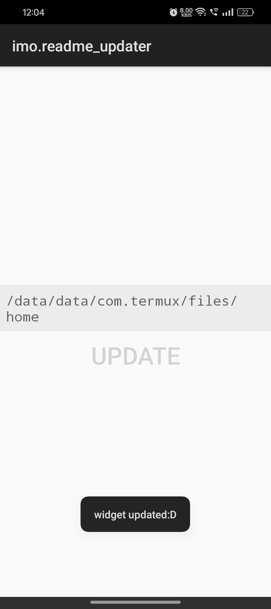
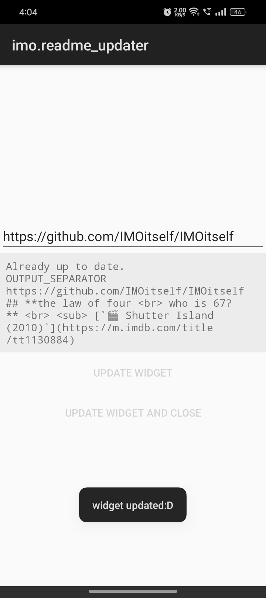
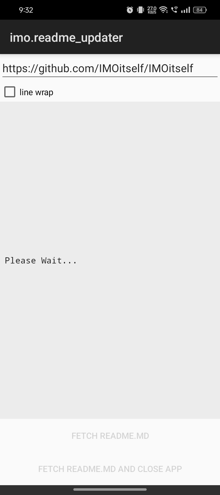
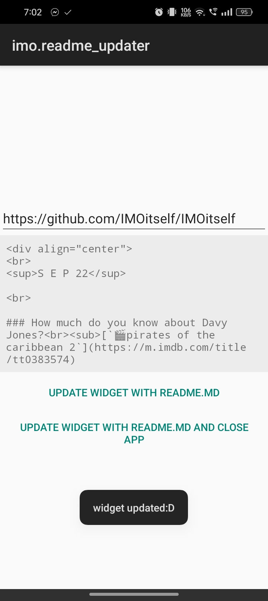

# readme-updater
**android app for updating github readme on your home screen**

 

## Download

 

 

## Feats and Progress

| Features |
| --- |
✅ home screen widget
✅ update widget
✅ remember widget content
✅ run bash commands via [AfterRun](https://github.com/IMOitself/AfterRun/tree/966e6317eba59add8cb193e976b77d6ca439bd8c) and Termux
⬜ clone a repo and set folder
⬜ get README.md
⬜ update a section of the README.md
⬜ commit locally
⬜ push to github

 

## Screenshots

> [!NOTE]
> last captured screenshot.  
> current development might differ.

 

